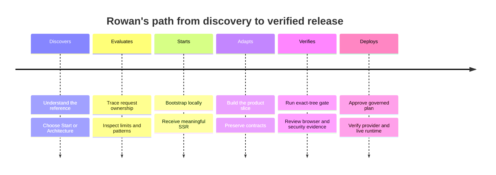

# Customer Journey Map — Rowan adopts `leptos-cf`

## Executive Summary

This hypothesis-mode journey follows a proof-oriented Rust builder from discovering the repository to completing a first governed deployment. The most important moment of truth is whether the visitor can connect the public promise to exact source and a reproducible local gate. The current demo-first homepage may obscure that decision; the leading opportunity is an architecture-first path with a clear start action and honest production boundaries. No interviews, analytics, or support corpus were supplied, so all emotions and user-behavior claims are low-confidence hypotheses.

## Persona / Segment

Rowan is a Rust-capable solo developer, technical founder, or small-team lead evaluating Leptos and Cloudflare as a production foundation. They are fluent enough to inspect source, but may be new to the exact SSR/hydration/Worker boundary. See `docs/PRODUCT_PERSONA.md`.

## Journey Scope

- **Journey type:** Linear
- **Included:** Discovery through local verification, provider planning, deployment, and first live readback
- **Excluded:** Long-term product operations, monetization, multi-tenant application design, and renewal

## Stages

| # | Stage | Customer goal | Duration | Entry trigger | Exit criterion |
| --- | --- | --- | --- | --- | --- |
| 1 | Discovers | Decide whether this is relevant | Seconds to minutes | Search, recommendation, or repository visit | Can state what it is and chooses a next action |
| 2 | Evaluates | Understand architecture and limits | 10–30 minutes | Opens architecture or source | Can explain core boundaries and non-guarantees |
| 3 | Starts | Run the project locally | 15–60 minutes | Chooses quick start | Local SSR route responds successfully |
| 4 | Adapts | Replace or extend the example domain safely | Hours to days | Local proof builds confidence | Product slice compiles and existing contracts remain intact |
| 5 | Verifies | Prove the exact candidate | Minutes to hours | Candidate is implementation-complete | Full local gate and browser checks pass |
| 6 | Deploys | Execute and verify production release | One release window | Target and artifact are prepared | Provider state and live runtime readback match the candidate |

## Touchpoints per Stage

| Stage | Touchpoint | Channel | What happens |
| --- | --- | --- | --- |
| Discovers | Homepage and repository summary | Web/GitHub | Sees architecture-led proposition and start action |
| Evaluates | Architecture, Patterns, About/Security | Web/docs/source | Maps promises to boundaries, proofs, and caveats |
| Starts | Quick start and agent playbook | Terminal/docs | Clones, bootstraps, migrates locally, runs edge build |
| Adapts | Source tree and patterns | Editor/docs | Changes routes/components while preserving runtime contracts |
| Verifies | `./scripts/verify.sh` and browser | Terminal/browser | Produces exact-tree local evidence |
| Deploys | Governed cfctl plan and live URL | CLI/Cloudflare/runtime | Reviews, approves, executes, and reads back separately |

## Emotional Curve

| Stage | Dominant emotion | Confidence | Source |
| --- | --- | --- | --- |
| Discovers | Curiosity with skepticism | Low | Hypothesis |
| Evaluates | Cautious confidence or overload | Low | Hypothesis |
| Starts | Focus mixed with setup anxiety | Low | Hypothesis |
| Adapts | Growing ownership or fear of breaking contracts | Low | Hypothesis |
| Verifies | Relief tempered by release scrutiny | Low | Hypothesis |
| Deploys | Controlled anticipation | Low | Hypothesis |

## Pain Points and Moments of Truth

| Stage | Pain / Moment of Truth | Severity | Customer evidence | Implication |
| --- | --- | --- | --- | --- |
| Discovers | Moment: understands “reference implementation,” not todo product | Moment of Truth (5) | Source mismatch only; no customer data | Make product identity first-screen |
| Evaluates | Pain: architecture and proof are scattered | 4 | Repository document inventory | Use one request-path model with deep links |
| Starts | Moment: fresh local route returns useful SSR | Moment of Truth (5) | Repo release contract | Quick start must remain exact and current |
| Adapts | Pain: de-templating can break route/migration coherence | 5 | Current `init.sh` inspection | Use deliberate migration and documented boundaries |
| Verifies | Moment: exact candidate passes local gate | Moment of Truth (5) | Repository doctrine | Never weaken or replace the gate |
| Deploys | Pain: local proof is mistaken for live release | 5 | Deployment doctrine | Separate plan, execution, provider, and runtime evidence |

## Opportunities

| Stage | Opportunity | Product change that addresses it | Effort |
| --- | --- | --- | --- |
| Discovers | Clarify the wedge | Architecture-first homepage with one adoption CTA | Medium |
| Evaluates | Make boundaries inspectable | Annotated request plate plus Architecture and Patterns routes | Medium |
| Starts | Shorten path to proof | First-screen quick-start link and exact command sequence | Small |
| Adapts | Prevent destructive cutover | Controlled Live Lab and explicit core/pattern ownership | Medium |
| Verifies | Make evidence legible | Release ledger separating proof planes | Small |
| Deploys | Prevent unsafe fallback | Governed cfctl lifecycle with exact artifact identity | Medium |

## Visual

## Research Gaps

- Recruit five target developers and test category comprehension, start-action findability, and architecture recall.
- Establish the current acquisition path and page-level drop-off with an owner-approved minimal analytics policy.
- Observe at least three fresh-checkout setup sessions to identify the actual abandonment point.
