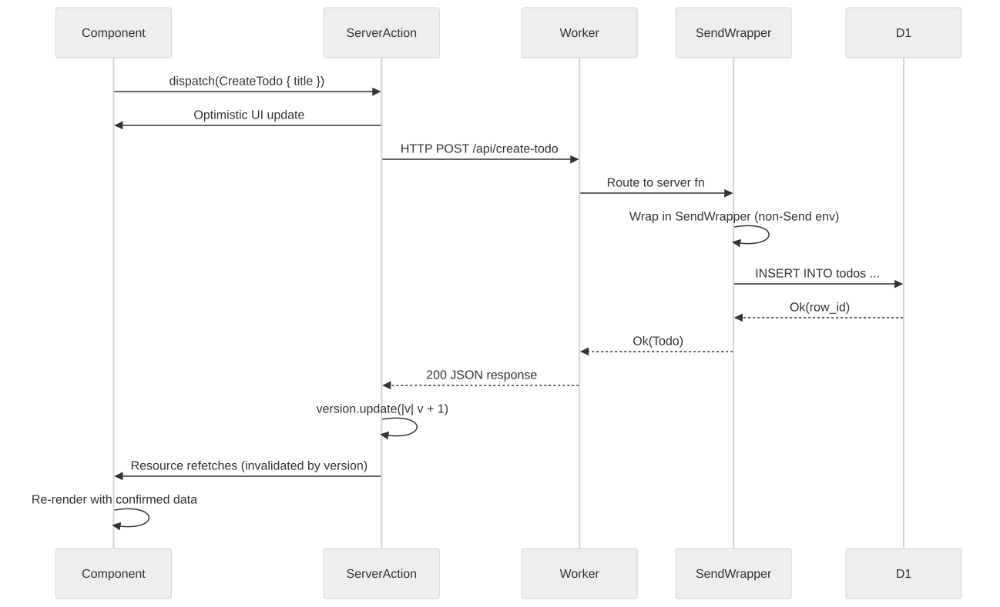
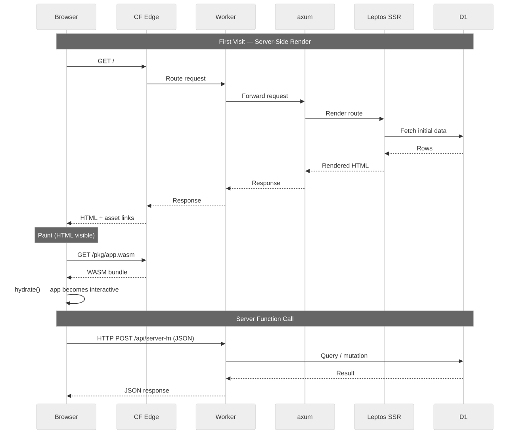

# How Leptos Works on Cloudflare Workers

This document explains the architecture of this project for developers who know Rust but haven't worked with Leptos or full-stack WASM before. It answers "why does the code look like this?" more than "what does each line do?"

---

## The Two WASMs

The release build compiles the shared application for two runtimes: browser WASM for hydration and server WASM for the Cloudflare Worker. Both run the shared component model, while small generated JavaScript modules load the WASM artifacts and provide the Worker module entrypoint.



```text
scripts/build-edge.sh
  ├── cargo leptos build --release
  │     └── lib target (--features hydrate) → browser WASM + JS glue + CSS/assets
  ├── hash-assets.mjs                      → immutable names + asset-manifest.json
  ├── worker-build --release --features ssr
  │     └── server Worker bundle           → build/index.js + server WASM
  └── write-worker-shim.mjs                → build/_worker.js

wrangler deploy
  ├── main: build/_worker.js
  └── assets: target/site
```

This is declared in `Cargo.toml`:

```toml
[package.metadata.leptos]
bin-features = ["ssr"]
bin-default-features = false
lib-features = ["hydrate"]
lib-default-features = false
```

The lib (`crate-type = ["cdylib", "rlib"]`) becomes the browser bundle under `target/site/pkg`. `worker-build` performs the deployable server build with the `ssr` feature and writes the Workers module bundle under `build/`. `scripts/write-worker-shim.mjs` then generates the configured entrypoint, `build/_worker.js`. Wrangler deploys that entrypoint and the `target/site` asset directory together; it does not deploy the ordinary Cargo bin output directly.

The consequence: your components are Rust, your routing is Rust, your data types are Rust. There is no template language, no serialization boundary to manually maintain between server and client code, and no JavaScript framework sitting between your logic and the DOM.

---

## SSR, CSR, and Hydration

### Server-Side Rendering (SSR)

When a request arrives at the Worker, Leptos renders your `App` component to HTML on the server. The response is a complete HTML document — the browser can paint it immediately without waiting for WASM to load.

The entry point is `src/lib.rs`:

```rust
#[cfg(feature = "ssr")]
#[worker::event(fetch)]
async fn fetch(
    req: worker::HttpRequest,
    env: worker::Env,
    _ctx: worker::Context,
) -> worker::Result<axum::http::Response<axum::body::Body>> {
    let conf = get_configuration(None)...;
    let request_identity = request_identity(&req)?;
    let request_nonce = leptos::nonce::Nonce::new();
    let routes = generate_route_list(app::App);
    let state = server::AppState::new(
        leptos_options.clone(),
        env,
        request_identity.session_id.clone(),
    );

    let mut router = Router::new()
        .layer(DefaultBodyLimit::max(MAX_SERVER_FUNCTION_BODY_BYTES))
        .leptos_routes_with_context(&state, routes, /* nonce context */, /* shell */)
        .with_state(state);

    let mut response = router.call(req).await?;
    // Normalize unknown document routes and apply CSP, cookie, framing,
    // content-type, referrer, and cache headers before returning.
    apply_response_headers(&mut response, &content_security_policy, &request_identity)?;
    Ok(response)
}
```

This excerpt is intentionally abbreviated; the checked-in handler also rejects unsafe API methods/origins/content types and oversized server-function bodies before constructing the router. `app::shell` returns the full HTML document. `leptos_routes_with_context` registers the Leptos routes inside an Axum router, which handles both SSR page requests and server-function endpoints.

### Hydrated Client Rendering

After hydration, the browser's WASM module owns the reactive application. `leptos_router` can change the URL and render the next route without requesting another HTML document. That does not mean the browser is offline: a route can still invoke a server function, load route data, request an asset, or open the realtime lane.

### Hydration

Hydration is the handoff between server-rendered HTML and the live WASM application. The browser receives the HTML, renders it immediately (fast first paint), then downloads the client WASM bundle. Once loaded, the `hydrate()` function runs:

```rust
#[cfg(feature = "hydrate")]
#[wasm_bindgen::prelude::wasm_bindgen]
pub fn hydrate() {
    console_error_panic_hook::set_once();
    leptos::mount::hydrate_body(app::App);
}
```

`hydrate_body` walks the server-rendered DOM and attaches Leptos's reactive system to it — event handlers, signals, resources — without re-rendering or discarding anything. The page becomes interactive without a visible flash or layout shift.

Pure CSR (no SSR) would serve an HTML shell and require the browser to load WASM before it could construct useful UI. SSR without hydration would return useful HTML but use document requests or progressive forms for later interaction. The current template intentionally chooses SSR + hydration: useful first-response HTML plus a resumed reactive client. Pure CSR remains a separate, unshipped pattern until a named consumer needs its different loading and hosting contract. The public `/architecture` page contains the full rendering and platform decision matrices.

---

## Server Functions



### The `#[server]` Macro

The `#[server]` macro draws a typed RPC boundary. On the server, the function body executes. On the client, the macro replaces the body with an HTTP POST to the generated endpoint.

From `src/api.rs`:

```rust
#[server(ListTodos)]
pub async fn list_todos() -> Result<TodosResponse, ServerFnError> {
    #[cfg(feature = "ssr")]
    {
        SendWrapper::new(async move {
            crate::server::todos::list_todos()
                .await
                .map_err(crate::server::server_error)
        })
        .await
    }

    #[cfg(not(feature = "ssr"))]
    {
        unreachable!("server functions only execute on the server")
    }
}
```

`#[server(ListTodos)]` registers a route at `/api/list_todos` (the name becomes the URL segment). The function signature — parameters in, `Result<T, ServerFnError>` out — is the complete contract. Leptos serializes the arguments as the POST body and deserializes the response. Both sides use the same Rust type; there is no manual JSON wiring.

The `TodosResponse`, `TodoItem`, and other types in `src/api.rs` are shared — they compile into both the server and client WASMs. The `serde` derives handle (de)serialization automatically.

### `ServerAction` for Mutations

Read-only data fetches use `Resource`. Mutations use `ServerAction`, which gives you pending state, version tracking, and the last result for free.

From `src/components/todo_page.rs`:

```rust
let create_action = ServerAction::<CreateTodo>::new();
let toggle_action = ServerAction::<ToggleTodo>::new();
let delete_action = ServerAction::<DeleteTodo>::new();

let todos = Resource::new(
    move || {
        (
            refresh_nonce.get(),
            create_action.version().get(),
            toggle_action.version().get(),
            delete_action.version().get(),
        )
    },
    |_| async move { list_todos().await },
);
```

`create_action.version()` is a signal that increments each time the action completes. By including all three action versions in the `Resource` key, the todo list automatically re-fetches after any mutation — no manual cache invalidation.

Dispatching an action is one line:

```rust
create_action.dispatch(CreateTodo { title });
```

Leptos tracks pending state and the last returned value on the action:

```rust
let submit_disabled =
    move || create_action.pending().get() || draft.with(|value| value.trim().is_empty());
```

`create_action.pending()` is a signal that's `true` while the HTTP call is in flight. The button disables itself reactively — no state management boilerplate.

### Optimistic UI

The `TodoRow` component demonstrates optimistic UI without any extra infrastructure:

```rust
let optimistic_completed = move || {
    if is_toggling() {
        !completed  // flip it immediately, before the server responds
    } else {
        completed   // use the real value otherwise
    }
};
```

`is_toggling()` checks whether `toggle_action` is pending for this specific todo's id. The completion state appears to flip immediately while the server call is in flight. If the server returns an error, the action's `.value()` signal emits `Err(...)` and the UI can surface the failure.

### The `SendWrapper` Pattern

Leptos server functions require their futures to be `Send` (they may be polled across threads in a multi-threaded tokio runtime). Cloudflare Workers is single-threaded — its types, including `D1Database`, are not `Send`.

`SendWrapper<T>` from the `send_wrapper` crate lies to the compiler: it wraps a non-`Send` type and asserts it is `Send`, enforcing at runtime that it is only accessed from the thread it was created on. Because Workers is single-threaded, this assertion never trips.

Every server function in `src/api.rs` uses this pattern:

```rust
send_wrapper::SendWrapper::new(async move {
    crate::server::todos::list_todos().await.map_err(...)
})
.await
```

Without it, the `worker::D1Database` type (obtained via `use_context::<AppState>()` inside the server function) would fail to compile because it isn't `Send`.

---

## Feature Flags

Feature flags are how the same source file compiles to two different artifacts.

```toml
[features]
hydrate = [
  "dep:console_error_panic_hook",
  "leptos/hydrate",
]
ssr = [
  "dep:axum",
  "dep:leptos_axum",
  "dep:worker",
  "leptos/ssr",
  "leptos_meta/ssr",
  "leptos_router/ssr",
]
```

`ssr` pulls in `axum`, `leptos_axum`, and `worker` — none of which should exist in the browser bundle. `hydrate` pulls in `console_error_panic_hook`, which wires Rust panics to the browser console.

Code guarded with `#[cfg(feature = "ssr")]` only compiles into the server WASM:

```rust
#[cfg(feature = "ssr")]
mod server;   // src/lib.rs — D1 access, AppState, Worker Env
```

Code guarded with `#[cfg(feature = "hydrate")]` only compiles into the client WASM:

```rust
#[cfg(feature = "hydrate")]
#[wasm_bindgen::prelude::wasm_bindgen]
pub fn hydrate() { ... }
```

Everything else — the `App` component, the field-guide pages, the lab components, the `api` module types, and server-function signatures — compiles into both. This is shared code. The `#[server]` macro handles the split: the function signature is shared, while each server-only body is guarded by `#[cfg(feature = "ssr")]`.

A practical consequence: the `server` module (`src/server/`) is never referenced in client builds. You can freely call `use_context::<AppState>()` and `.db()` inside server function bodies without worrying about those types leaking to the browser — they're behind `#[cfg(feature = "ssr")]` and won't compile into the client artifact.

---

## The Request Lifecycle



### First Visit

1. The browser sends `GET /` to the Cloudflare edge.
2. Workers Static Assets checks `target/site`. `/` is not an exact asset, so the request continues to the configured Worker entrypoint, `build/_worker.js`.
3. The generated shim checks the WebSocket capability route and explicit asset fallback paths, then delegates the document request to the Rust Worker bundle.
4. The Worker handler applies request guards, creates the cookie-scoped identity and per-response CSP nonce, then calls the Axum router.
5. Leptos matches `/` to `HomePage` inside `AppLayout` and streams a complete HTML document. A first visit to `/lab` follows the same path and can execute its D1-backed `Resource` in the server bundle without a browser-to-API round trip.
6. The browser can paint the useful route HTML immediately.
7. The document references immutable `/pkg/` CSS, JavaScript, and WASM names generated from `asset-manifest.json`. Exact asset requests are served by Workers Static Assets without invoking user Worker code.
8. `hydrate()` runs, attaching Leptos's reactive graph and event handlers to the server-rendered DOM.
9. The app is interactive. Router navigation does not need a new HTML document, while server functions and route data can still make focused network requests.

### Subsequent Navigation

The `leptos_router::Router` handles navigation client-side. When the user follows a router link, it matches the path, renders the component in WASM, and updates the DOM without fetching a replacement document. Any component-level server function, data request, asset load, or realtime connection still crosses the network normally.

### Server Function Call

When the user submits the create-todo form:

1. `create_action.dispatch(CreateTodo { title })` fires.
2. Leptos serializes `CreateTodo { title }` and sends `POST /api/create_todo`.
3. The Worker's axum router routes the request to the `create_todo` server function handler.
4. The function body executes: validates the title, runs the D1 insert, fetches the new row.
5. The result is serialized to JSON and returned as the HTTP response.
6. The client WASM deserializes the response into `Result<TodoItem, ServerFnError>`.
7. `create_action.value()` emits the result. `create_action.version()` increments.
8. The `todos` Resource detects the version change and re-fetches `list_todos()`.
9. The todo list re-renders with the new item.

---

## Reactivity Model

Leptos uses fine-grained reactivity. Instead of re-rendering a component tree when state changes, individual DOM nodes subscribe to specific signals and update themselves.

**Signals** are the basic unit: `RwSignal<T>` holds a value and notifies subscribers when it changes. Reading a signal inside a reactive context (a component, a closure passed to `view!`, an `Effect`) automatically creates a subscription.

```rust
let draft = RwSignal::new(String::new());

// This closure re-runs whenever `draft` changes.
// Only the value of the input element updates — not the whole component.
prop:value=move || draft.get()
```

**Resources** are async signals: they represent a value that must be fetched. When their key changes, they re-fetch and update their value signal.

```rust
let todos = Resource::new(
    move || (refresh_nonce.get(), create_action.version().get(), ...),
    |_| async move { list_todos().await },
);
```

The first closure is the key. Any signal read inside it becomes a dependency. When any dependency changes, the resource re-runs the second closure (the fetcher).

**Effects** run side effects in response to signal changes:

```rust
Effect::new(move |_| {
    if let Some(Ok(_)) = create_action.value().get() {
        draft.set(String::new());   // clear the input after successful create
        local_error.set(None);
    }
});
```

This runs once on mount, reads `create_action.value()`, and re-runs whenever that signal changes.

The reactivity system works identically on server and client. On the server, Leptos runs the reactive graph once to produce HTML. On the client, the same graph runs continuously, driving DOM updates. Your components don't need to know which environment they're in.

---

## File Map

| Path | What it is |
|------|-----------|
| `src/lib.rs` | Worker `fetch` entry point (ssr) and `hydrate()` entry point (hydrate) |
| `src/app.rs` | Root `App`, `shell()` document wrapper, hashed hydration assets, field-guide router, and wildcard |
| `src/api.rs` | Shared types (`TodoItem`, etc.) and all `#[server]` function declarations |
| `src/components/home_page.rs` | Public request-path field guide at `/` |
| `src/components/architecture_page.rs` | Rendering, platform, asset-router, and ownership decisions at `/architecture` |
| `src/components/start_page.rs` | Checked-in setup path at `/start` |
| `src/components/patterns_page.rs` | Pattern index at `/patterns` |
| `src/components/todo_page.rs` | D1-backed `/lab` UI: form, list, optimistic updates, and error handling |
| `src/components/todo_detail_page.rs` | Dynamic `/lab/:id` detail route and compatibility `/todo/:id` route |
| `src/server/state.rs` | `AppState` — holds `LeptosOptions`, `worker::Env`, and the scoped session ID |
| `src/server/todos.rs` | D1 query implementations for list/create/toggle/delete |
| `src/server/mod.rs` | Re-exports and the `server_error` helper |
| `Cargo.toml` | Feature declarations and `[package.metadata.leptos]` build config |
| `scripts/build-edge.sh` | Ordered browser build, asset hashing, Worker build, shim generation, and runtime verification |
| `scripts/write-worker-shim.mjs` | Generates the WebSocket/asset/SSR dispatch layer at `build/_worker.js` |
| `wrangler.toml` | Worker entrypoint, Workers Static Assets, D1, compatibility date, and observability |
